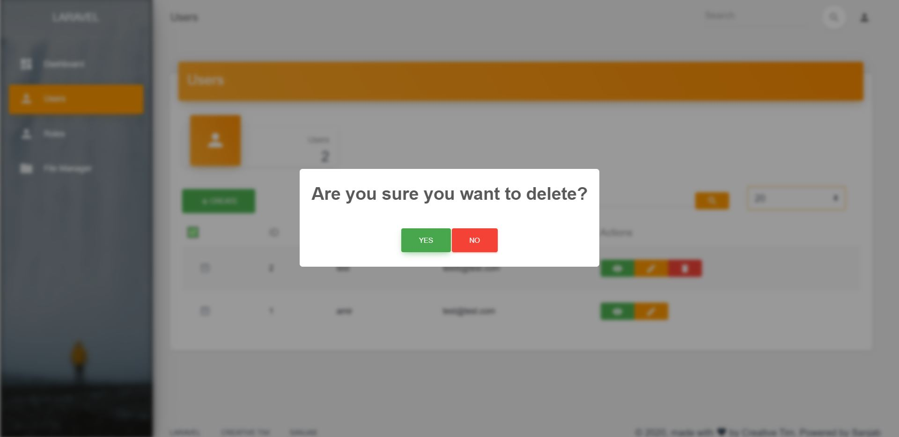
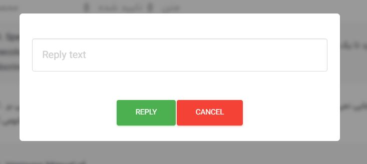
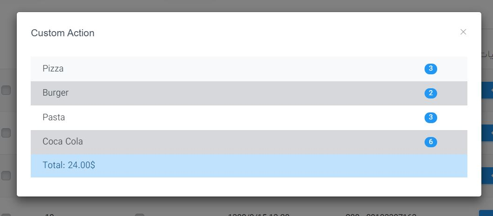

# Actions

- [Example](#example)
- [Action Types](#action-types)
  - [URL](#url)
  - [Ajax](#ajax)
  - [Custom component modal](#custom-component-modal)
- [Properties](#properties)
- [Authorization](#authorization)
- [Bulk](#bulk)
- [Prepend an action](#prepend-an-action)

Actions are buttons that defined in [CRUD controllers](./crud.md).

## Example

This example creates a link button at the top of the list.

```php
use Sanjab\Helpers\Action;

 $this->actions[] = Action::create('All Products')
                ->icon(MaterialIcons::LINK)
                ->url(route('products'));
```

And the following example creates a link button for each one of the items in the table.

```php
use Sanjab\Helpers\PerItemAction;

 $this->actions[] = PerItemAction::create('Product Page')
                ->icon(MaterialIcons::LINK)
                ->url(function ($product) {
                    return route('product', $product);
                })
                ->target('_blank');
```

## Action Types

There are 3 types of actions in sanjab.
* Link actions
* Ajax actions with [sweetalert](https://sweetalert2.github.io/) confirmation popup
* Custom [Vue.js](https://vuejs.org/) components inside a modal using [Custom Compile](./compile.md)

### URL
You can create a link as a button above the table or in the actions section of the CRUD table.
All you need to do is set the URL property of action.
For example `create` / `edit` buttons in a CRUD table are URL actions.

Example:
```php
use Sanjab\Helpers\Action;

 $this->actions[] = Action::create('All Products')
                ->icon(MaterialIcons::LINK)
                ->url(route('products'));
```

### Ajax
You can show a confirm popup with sweet alert and then use ajax to do an action.
For example delete button in CRUD controllers is an Ajax action.


To create an ajax action you need to set `action` property of action.
```php
use Sanjab\Helpers\Action;

$this->actions[] = Action::create('Approve comment')
                ->perItem(true)
                ->action('approve'); // this is your action
```
Then you need create a function in your CRUD controller with your action name.
```php
use \App\YourModel;

public function approve(YourModel $item)
{
    // Do what ever should be done
    return ['success' => true]; // You should return this to show a successful message after ajax finished.
}
```

To customize confirm message you should set `confirm` property.
```php
->confirm('Are you want to approve this comment?')
```

Also if you want to customize successful message you should define message in your return.
```php
public function approve(YourModel $item)
{
    // ...
    return ['success' => true, 'message' => 'You confirmed comment successfully.'];
}
```
You can also show a error message if action was not successful.
```php
public function approve(YourModel $item)
{
    if (/* ... */) {
        return ['success' => false, 'message' => 'This action is not allowed for this item.'];
    }
    // ...
    return ['success' => true, 'message' => 'You confirmed comment successfully.'];
}
```

#### Ajax with an input.
With the sweet alert, you can define an input inside popup to get input from the user.

```php
use Sanjab\Helpers\Action;

$this->actions[] = Action::create('Reply')
                ->perItem(true)
                ->action('replyComment')
                ->confirmInput('text')
                ->confirmInputTitle('Reply Text')
                ->confirm('Reply to a comment');
                ->confirmYes('Reply')
```
And you can validate and use input value like this.
```php
use App\Comment;
use Illuminate\Http\Request;

public function replyComment(Request $request, Comment $comment)
{
    $request->validate(['input' => 'require|string|min:5']);
    $comment->reply($request->input('input')); // Or anything else
    return ['success' => true, 'message' => 'You replied successfully!'];
}
```

### Custom component modal

You should know how to compile sanjab yourself to make custom components so please read [Custom Compile](./compile.md) documents first.

To create a custom component modal you need to set tag property and also create your Vue component and register it.

```php
use Sanjab\Helpers\Action;

$this->actions[] = Action::create('Order List')
                ->tag('order-list')
                ->perItem(true)
                ->modalSize("lg")
                ->variant("primary")
```
Then you should create a vue component.

OrderList.vue:
```vue
<template>
    <div>
      {{ item.name }}
    </div>
</template>

<script>
    export default {
        props: {
            item: null
        },
    }
</script>
```
> item property is your selected item.

But to get more information or do more actions you need some custom actions in your CRUD controller.
To do that first create your method and submit routes:
```php
use App\Order;
use Illuminate\Support\Facades\Route;

/**
  * Get order list.
  *
  * @return \Illuminate\Database\Eloquent\Collection
  */
public function orderList(Order $order)
{
    return $order->products; // Or anthing else as response
}

public static function routes(): void
{
    parent::routes();
    Route::prefix("modules")->name("modules.")->group(function () {
        Route::get(static::property('route').'/{order}/list', static::class.'@orderList')->name(static::property('route').'.order-list');
    });
}
```
And your ajax code would be something like this:
```js
export default {
    props: {
        item: null
    },
    data() {
        return {
            orderList: null
        }
    },
    mounted () {
        this.loadOrderList();
    },
    methods: {
        loadOrderList() {
            var self = this;
            axios.get(sanjabUrl('modules/orders/'+ this.item.id + '/list')) // use sanjabUrl to get full URL
            .then(function (response) {
                self.orderList = response.data; // Your data is here!
            })
            .catch(function (error) {
                console.error(error);
                setTimeout(() => self.loadOrderList(), 1000); // retry after 1 second
            });
        }
    }
}
```

## Properties

#### url
`type: string|callable`

URL for link actions. if you are creating a per item action then its recommended to use a callback.
```php
->url(function ($item) {
    return route('test', ['item' => $item]);
})
```

#### target
`type: string`

Html target attribute for the link button.

#### perItem
`type: boolean`

Set true if you want a button inside table different per item.

Alternatively, you can use `Sanjab\Helpers\PerItemAction` class instead of `Sanjab\Helpers\Action` Class.

#### bulk
`type: boolean`

By default all per item ajax actions also available as a bulk action.
Set this to false if you don't want this behavior.

#### variant
`type: string`

Action button bootstrap variant (Examples: 'success', 'danger', ...)

#### tag
`type: string`

If you want an action inside a modal with custom Vue.js component then set your component tag with this property.

#### tagContent
`type: string`

If you are using custom component action then with this property you can set content of inside your tag and recive it with a [slot](https://vuejs.org/v2/guide/components-slots.html) in your component.
```html
<your-component>
  {{ tagContent }}
</your-component>
```

#### tagAttributes
`type: array`

You can set attribute dynamically per each action with this property. and you can recevice values in your component with [props](https://vuejs.org/v2/guide/components-props.html).
Example:
```php
->tagAttributes(['width' => 50, 'height' => 50])
```

#### modalSize
`type: string`

Size of the bootstrap modal. (sm, md, lg)

#### action
`type: string`

If you want an ajax action then set this to your function name.
Example:
```php
use Sanjab\Helpers\Action;

 $this->actions[] = Action::create('Approve')
                ->perItem(true)
                ->action('approve')
                ->confirm('Are you sure for approve this?')
                ->variant('success');

// ...

public function approve(\App\YourModel $item)
{
    // ...
    return ['success' => true];
}
```

#### confirm
`type: string`

If you are using ajax action then this is alert's confirm text.

Example:
```php
->confirm('Are you sure for approving this?')
```

#### confirmYes
`type: string`

Yes button text.

#### confirmNo
`type: string`

No button text.

#### confirmOk
`type: string`

Ok button text.

#### confirmInput
`type: string`

if you want a text input in your alert then set this to HTML input type.

Example:
```php
->confirmInput('text')
```

#### confirmInputTitle
`type: string`

Placeholder of confirm input.

#### confirmInputAttributes
`type: array`

Attributes of confirm input.

Example:
```php
->confirmInput('number')
->confirmInputAttributes(['min' => 0, 'max' => 1000])
```

## Authorization
You can check the authorization of a button and hide the button if needed with the authorize property.

Example:
```php
->authorize(function () {
    return Auth::user()->can('do-that');
})
```

If you have a per item and authorization for each item is different then you can receive the item with parameter.

Example:
```php
->authorize(function ($item) {
    return $item->user_id == Auth::id() || Auth::user()->isA('super_admin');
})
```

## Bulk

By default, all ajax actions have bulk action.
You can disable this feature by setting `bulk` property to false.
You don't need to do any changes to your code.
Your code will work for both single and bulk ajax actions.

```php
use App\Comment;
use Illuminate\Http\Request;
use Sanjab\Helpers\Action;

$this->actions[] = Action::create('Reply')
                ->icon(MaterialIcons::CHAT)
                ->perItem(true)
                ->action('replyComment')
                ->confirmInput('text')
                ->confirmInputTitle('Reply Text')
                ->confirm('Reply to a comment')
                ->variant('warning')
                ->authorize(function ($item) {
                    return $item->reply_id == null; // 1 level comment replies
                })

// ...

public function replyComment(Request $request, Comment $comment)
{
    // ...
    return ['success' => true, 'message' => 'You replied successfully!'];
}
```

But if you want to receive all items at once not one-by-one when using bulk action then you should use `Collection` class type in your method parameter.
```php
use Illuminate\Support\Collection;

public function replyComment(Collection $comments)
{
    foreach ($comments as $comment) {
      // ...
    }
    // ...
    return ['success' => true, 'message' => 'You replied to '.$comments->count().' comment'.($comment->count() == 1 ? '' : 's').' successfully!'];
}
```

## Prepend an action
If you want to put your action before all existing actions in the CRUD list you should use `array_unshift` to prepend action.

```php
array_unshift(
    $this->actions,
    Action::create('Order List')
        ->tag('order-list')
        ->perItem(true)
);
```
