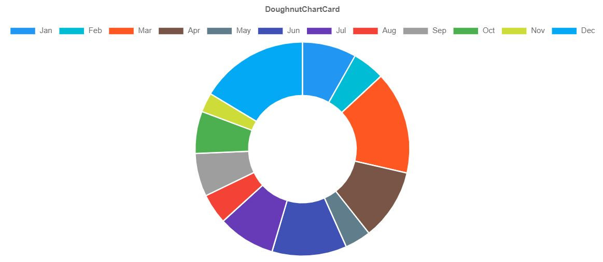

# Doughnut Chart Card



A doughnut chart based on [chart.js](https://www.chartjs.org/docs/latest/charts/doughnut.html).

## Sample
```php
use Sanjab\Helpers\ChartData;
use Sanjab\Cards\DoughnutChartCard;
use Sanjab\Helpers\MaterialColors;

$this->cards[] = DoughnutChartCard::create('Incomes')
    ->labels(['Jan', 'Feb', 'Mar', 'Apr', 'May', 'Jun', 'Jul', 'Aug', 'Sep', 'Oct', 'Nov', 'Dec'])
    ->addData(
        ChartData::create('Income')
        ->data(function () {
            return array_map(function ($r) {
                return rand(0, 100);
            }, range(0, 11));
        })
        ->color(MaterialColors::randomArray(12))
    )
    ->height(300);

```

You can use `addData` to add Chart Data to the chart dataset.
```php
->addData(
    ChartData::create('Income 1')
        ->data(...)
        ->color(...)
)
```

Alternativly you can use `addCards` with an array of Chart Data.
```php
->addMultipleData([
    ChartData::create('Income 1')
        ->data(...)
        ->color(...),
    ChartData::create('Income 2')
        ->data(...)
        ->color(...),
])
```

## Properties

### height
`type: integer`

Height of the chart in pixels.

### borderless
`type: boolean`

Set this to false to get a card border around the chart.

### labels
`type: array|callable`

An array of chart labels.

```php
->labels(['Jan', 'Feb', 'Mar', 'Apr', 'May', 'Jun', 'Jul', 'Aug', 'Sep', 'Oct', 'Nov', 'Dec'])
```
Or
```php
->labels(function () {
    return ['Jan', 'Feb', 'Mar', 'Apr', 'May', 'Jun', 'Jul', 'Aug', 'Sep', 'Oct', 'Nov', 'Dec'];
})
```

## ChartData Properties

### label
`type: string`

The label of chart data.
you can set the label in the argument of `create` method.

```php
ChartData::create('Data Label')
```

### data
`type: array|callable`

Data of chart data.

> Highly recommended to use callback instead of raw value in order to prevent extra database queries.

```php
->data(function () {
    // You query to get data here
    return $resultAsArray;
})
```
### color
`type: string|array`

Color of chart data.
You can use the `MaterialColors` helper class.
```php
use Sanjab\Helpers\MaterialColors;

->color(MaterialColors::theme())
// Or
->color(MaterialColors::random())
// Or
->color(MaterialColors::randomArray($count))
```
