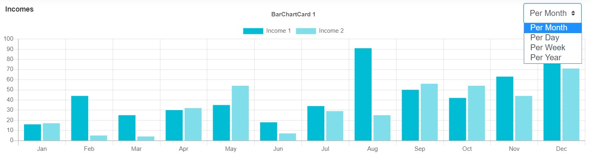

# Selective Card



A collection of cards with a select box to show only one card. Its also using ajax to load data to optimize page load speed.

## Sample
```php
use Sanjab\Helpers\ChartData;
use Sanjab\Cards\BarChartCard;
use Sanjab\Cards\SelectiveCard;
use Sanjab\Helpers\MaterialColors;

$this->cards[] = SelectiveCard::create('Incomes')
    ->addCard(
        'Chart 1',
        BarChartCard::create('Chart 1')
            ->labels(function () {
                return ['Jan', 'Feb', 'Mar', 'Apr', 'May', 'Jun', 'Jul', 'Aug', 'Sep', 'Oct', 'Nov', 'Dec'];
            })
            ->addData(
                ChartData::create('Income 1')
                ->data(function () {
                    return [...];
                })
                ->color(MaterialColors::theme())
            )
            ->addData(
                ChartData::create('Income 2')
                ->data(function () {
                    return [...];
                })
                ->color(MaterialColors::theme('200'))
            )
            ->height(300)
    )
    ->addCard(
        'Chart 2',
        BarChartCard::create('Chart 2')
            ->labels(['Jan', 'Feb', 'Mar', 'Apr', 'May', 'Jun', 'Jul', 'Aug', 'Sep', 'Oct', 'Nov', 'Dec'])
            ->addData(
                ChartData::create('Income')
                    ->data(function () {
                        return [...];
                    })
                    ->color(MaterialColors::random())
            )
            ->height(300)
    );
```

You can use `addCard` to add a card to card collection.
```php
->addCard('Title', ...)
```

Alternativly you can use `addCards` with an array of cards.
```php
->addCards([
    'title 1' => ...,
    'title 2' => ...,
])
```

## Properties

### inline
`type: boolean`

By default, selective card title and select box overlay on top of the current card and its optimized for charts. If you want to show title and select box out of card set this to `false`.


