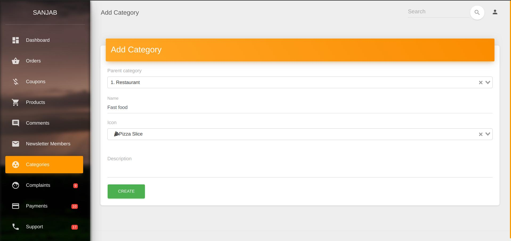
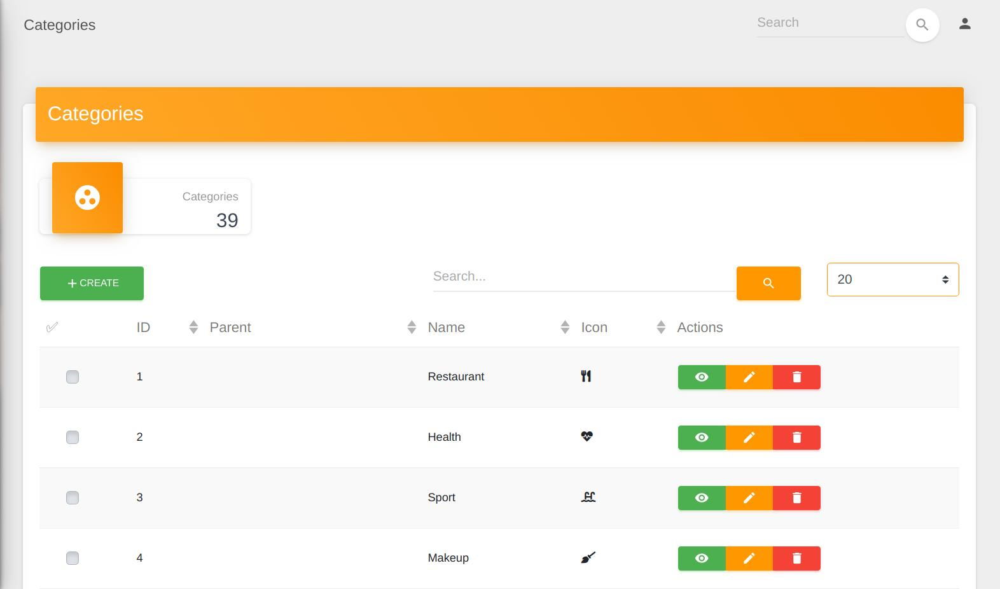

# Sanjab
Sanjab is an admin package for laravel.

Sanjab let you create an extendiable admin panel as fast as possible with pure code.

Spend less time on admin side and focus on client side instead.

> This project is in the early stages and **is NOT ready** for **production** usage yet. Use it with your own risk.

* [Installation](./install.md)
* [Configuration](./install.md#Configuration)
* [Crud Controllers](./crud.md)
* [Setting Controllers](./setting.md)
* [Widgets](./widgets.md)
* [Cards](./cards.md)
* [Authorization](./authorization.md)
* [Localization](./localization.md)

## Features
* CRUD controllers that working with eloquent models.
* Customizable CRUD buttons.
* Multiple input types and cards.
* Extendiable for custom input type, cards and ... based on vue.js.
* Just pure customizable code. no generator interface / magic at all.
* Setting support with no pain.
* Role/Permission support based on [bouncer](https://github.com/JosephSilber/bouncer).
* Model policy support.
* Multilingal inputs support based on [laravel translatable](https://github.com/Astrotomic/laravel-translatable).
* Realtime notification tracking with toast and/or sound notification support.

