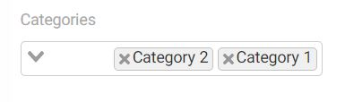

# BelongsToMany Relation Widget


Select box with multiple values to handle eloquent BelongsToMany relation.

## Sample
```php
use Sanjab\Widgets\Relation\BelongsToManyPickerWidget;

$this->widgets[] = BelongsToPickerWidget::create('categories')
                        ->format('%name')
                        ->ajax(true)
                        ->required();
```

You also should define `BelongsToMany` relation in your model.
```php
/**
 * Categories of blog post.
 *
 * @return \Illuminate\Database\Eloquent\Relations\BelongsToMany
 */
public function categories()
{
    return $this->belongsToMany(Category::class);
}
```

You can also use a group of checkboxes instead of the select box (Has some limits).


```php
use Sanjab\Widgets\Relation\BelongsToManyWidget;

$this->widgets[] = BelongsToManyWidget::create('roles')
                        ->format('%name')
                        ->required();
```

## Properties

### query
`type callable`

A callback function to modify the query of options.

Example:
```php
use Illuminate\Database\Eloquent\Builder;

->query(function (Builder $query) {
    $query->whereNotNull('parent_id'); // Only categories that has no parent_id
});
```

### searchFields
`type: array`

An array of fields to search when working with [ajax](#ajax). By default [format](#format) will fill this option for you.

Example:
```php
->searchFields(['id', 'name']); // Search in id and name.
```

### format
`type: string | callable`

Format of items to show in the select box.

For access to the related model you should prepend the field name with `%`.

Example:
```php
->format('%id - %name') // Result will be look like "CategoryId - Category Name"
```

You can also set a callback to do that but if you are using [ajax](#ajax) you must provide [searchFields](#searchfields) manually.

Example:
```php
use App\Category;

->format(function (Category $category) {
    return $category->id.' - '.$category->name;
})
->searchFields(['id', 'name'])
```

### ajax
`type: boolean`

Should items inside select box load using ajax after the user typed something to search?
Recommended if items on the related model are too many.

```php
->ajax(true)
```

### creatable
`type: callable`

Can create a new item on the fly based on searched text.
Recommended only for relation entries has only one required field.

Example:
```php
->creatable(function ($value) {
    return \App\Category::create(['name' => $value]); // Create new item based on searched text and then return it to assign.
})
```

### creatableText:
`type: string`

By default for example if you search "sandwich" then the creatable option will look like this.
`Create: sandwich`

You can change Create by this option.

```php
->creatableText('Make') // Creatable Option -> Make: sandwitch
```

### max
`type: int`

Maximum count of related items allowed to select.

### pivotValues
`type: array`

Default values of columns in the pivot table.

```php
->pivotValues(['fieldOne' => 'Value one', 'fieldTwo' => 'Value Two'])
```
