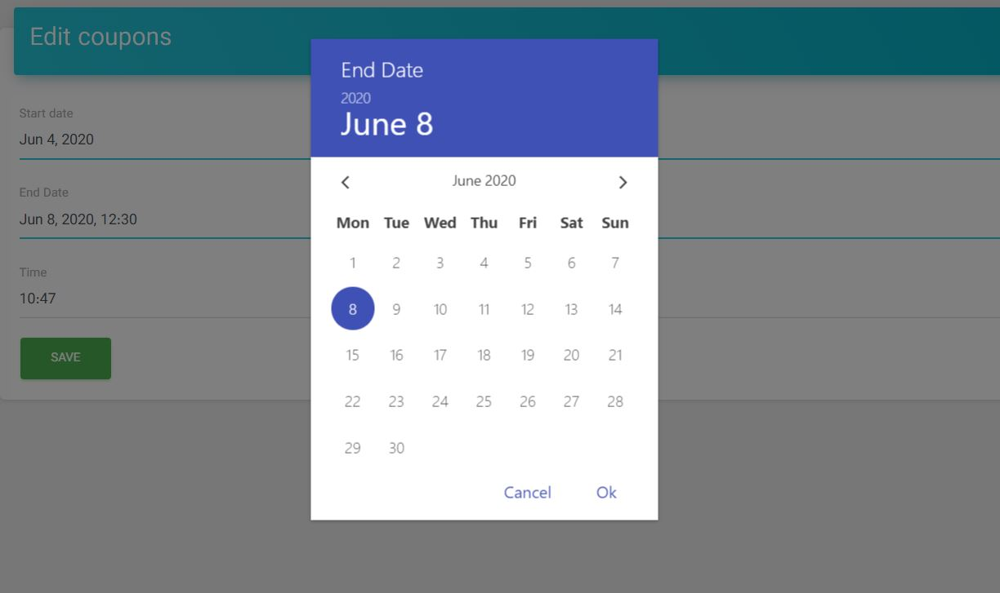

# Date Time Widget


A date-time picker input. based on [vue-datetime](https://github.com/mariomka/vue-datetime).

## Sample
```php
use Sanjab\Widgets\DateTimeWidget;

$this->widgets[] = DateTimeWidget::create('end_date')
                            ->required()
                            ->use12HourFormat()
                            ->auto(true)
                            ->minDateTime(now())
                            ->dateOnly();
```
You should also define casts for your fields.

```php
protected $casts = [
    'end_date'        => 'datetime',
    'another_one'     => 'date',
    'and_another_one' => 'time',
];
```

## Properties

### dateOnly , timeOnly
By default widget using for date-time. if you want only-date or only-time you can use these.

```php
$this->widgets[] = DateTimeWidget::create('open_time')
                            ->timeOnly();
```

### use12HourFormat
`type: boolean`

If you want your time be in 12 hour format (AM/PM) call this.
```php
$this->widgets[] = DateTimeWidget::create('sample')
                            ->use12HourFormat();
```

### minDateTime
`type: Carbon\Carbon`

set minimum DateTime for input.
```php
use Carbon\Carbon;

$this->widgets[] = DateTimeWidget::create('sample')
                            ->minDateTime(Carbon::parse('2000-01-01'));
```

### maxDateTime
`type: Carbon\Carbon`

set maximum DateTime for input.
```php
$this->widgets[] = DateTimeWidget::create('sample')
                            ->maxDateTime(today()->subYears(18));
```

### auto
`type: boolean`

Auto continue/close on select.

### weekStart
`type: integer`

First day of the week. 1 is Monday and 7 is Sunday.

### hourStep
`type: integer`

Hour step.

### minuteStep
`type: integer`

Minute step.
