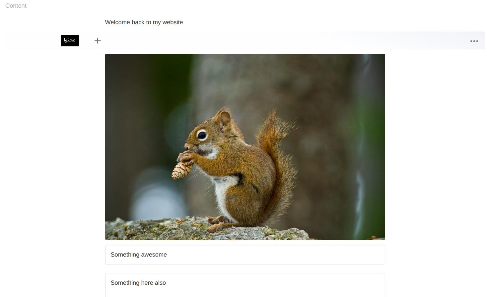

# Editor.js widget


A WYSIWYG editor based on [Editor.js](https://github.com/codex-team/editor.js).

## Sample
```php
use Sanjab\Widgets\Wysiwyg\EditorJsWidget;

$this->widgets[] = EditorJsWidget::create('content');
```

You also should define `$casts` in your model.
```php
protected $casts = [
    'content' => 'array'
];
```
