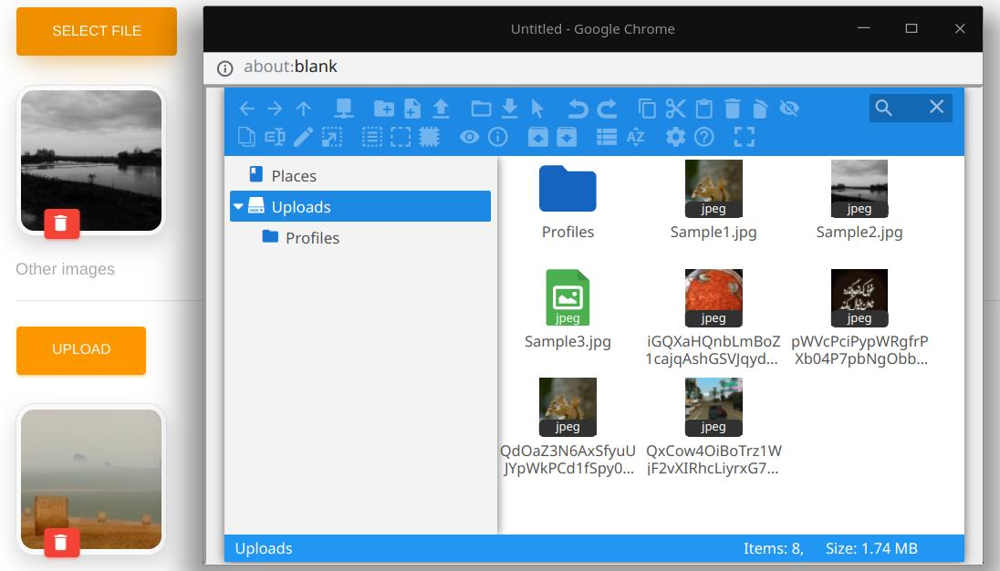

# Elfinder widget


An [elFinder](https://github.com/Studio-42/elFinder) file picker widget.

## Sample
```php
use Sanjab\Widgets\File\ElFinderWidget;

$this->widgets[] = ElFinderWidget::image('image', 'Image')
    ->disk('local');

$this->widgets[] = ElFinderWidget::create('videos', 'Videos')
    ->videoOnly()
    ->multiple();

$this->widgets[] = ElFinderWidget::create('manual', 'Manual')
    ->mimeTypes(['application/pdf']);
```

## Properties

### min
`type: number`

the minimum number of files.

### max
`type: number`

the maximum number of files.

### maxSize
`type: number`

maximum size of each file in KiloBytes.

### disk
`type: string`

default: `'public'`

Disk name to show in the file manager.

### fileRules
`type: string | array`

File validation rules.

```php
->fileRules('dimensions:min_width=100,min_height=200')
```

### multiple
`type: boolean`

Allow to upload multiple files.
```php
$this->widgets[] = ElFinderWidget::image('images', 'Images')
    ->multiple()
```

> You should also add `$casts` in your model.
```php
protected $casts = [
    'images' => 'array'
];
```
