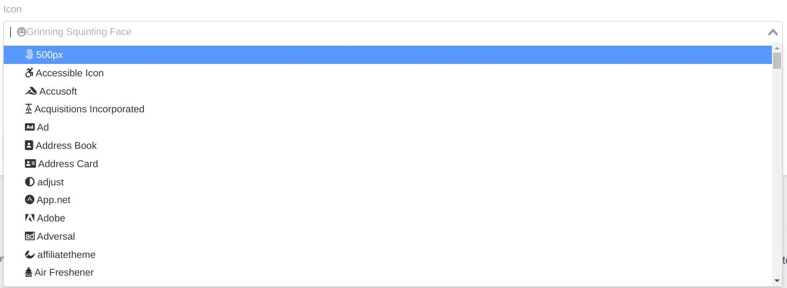

# FontAwesome Widget


[Fontawesome](https://fontawesome.com) Icon picker.

## Sample
```php
use Sanjab\Widgets\FontAwesomeWidget;

$this->widgets[] = FontAwesomeWidget::create('icon', 'Page Icon');
```

