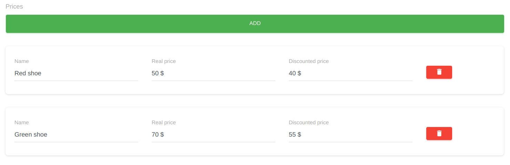

# Has Many Relation Widget


HasMany is a list of entities with HasMany relation. interface and functionality is look like [ItemListWidget](./item-list.md) but for HasMany relation instead of array.

## Sample
```php
use Sanjab\Widgets\TextWidget;
use Sanjab\Widgets\MoneyWidget;
use Sanjab\Widgets\NumberWidget;
use Sanjab\Widgets\Relation\HasManyWidget;

$this->widgets[] = HasManyWidget::create('prices')
    ->addWidget(TextWidget::create('color')->required()->cols(4))
    ->addWidget(NumberWidget::create('size')->required()->cols(4))
    ->addWidget(MoneyWidget::create('price')->required()->cols(4))
    ->required();
```

You also should define `HasMany` relation in your model.
```php
/**
 * Prices of product based on color and size.
 *
 * @return \Illuminate\Database\Eloquent\Relations\HasMany
 */
public function prices()
{
    return $this->hasMany(ProductPrice::class);
}
```

You can use `addWidget` to add one widget or `addWidgets` to add an array of widgets.
