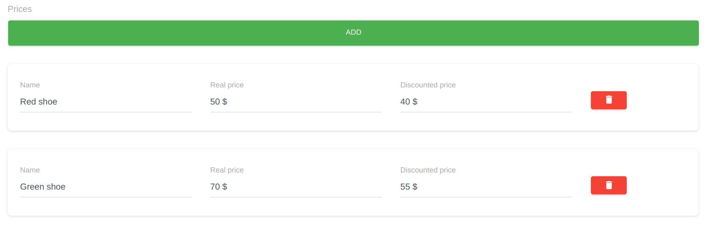

# Item List Widget


This widget used to store an array of fields.

## Sample
```php
use Sanjab\Widgets\ItemListWidget;
use Sanjab\Widgets\TextWidget;
use Sanjab\Widgets\File\UppyWidget;

$this->widgets[] = ItemListWidget::create('gallery')
    ->addWidget(TextWidget::create('title')->required())
    ->addWidget(UppyWidget::image('image')->required());
```

You also should define `$casts` in your model.
```php
protected $casts = [
    'gallery' => 'array'
];
```

and the result will be something like this.
```php
[
  [
    "title" => "test 2",
    "image" => "image1.jpeg"
  ],
  [
    "title" => "test",
    "image" => "image2.jpeg"
  ]
]
```

You can use `addWidget` to add one widget or `addWidgets` to add an array of widgets.
