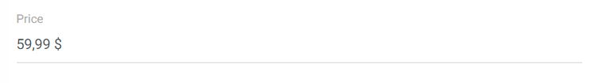

# Money Widget


A number input but for currencies. MoneyWidget is based on [v-money](https://github.com/vuejs-tips/v-money).

## Sample
```php
use Sanjab\Widgets\MoneyWidget;

$this->widgets[] = MoneyWidget::create('price', 'Product Price')
                            ->required();
```

You also should define `$casts` in your model.
```php
protected $casts = [
    'price' => 'int'
];
```

## Properties

### min
`type: number`

minimum value.

### max
`type: number`

maximum value.

### decimal
`type: string`

what character should be used for decimal separator.

### thousands
`type: string`

what character should be used for the thousands separator.

### prefix
`type: string`

Any text before money input.

### postfix
`type: string`

Any text after money input. (like currency)

```php
->postfix('€')
```

### precision
`type: number`

the precision of money input.

```php
->precision(0)
```

### zeroAsNull
`type: boolean`

If you want to save value 0 as null in your database set this property to true.
