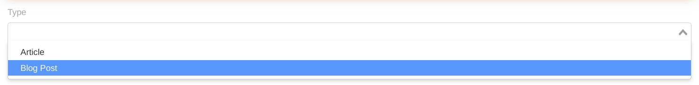

# Select Widget


A Selectbox input based on [Vue Select](https://vue-select.org/).

## Sample
```php
use Sanjab\Widgets\SelectWidget;

$this->widgets[] = SelectWidget::create('select', 'Test Select')
    ->addOptions(['test1' => 'Test 1', 'test2' => 'Test 2', 'test3' => 'Test 3'])
```

## Options
You can add an option to select with `addOption` or add multiple options using `addOptions`.
