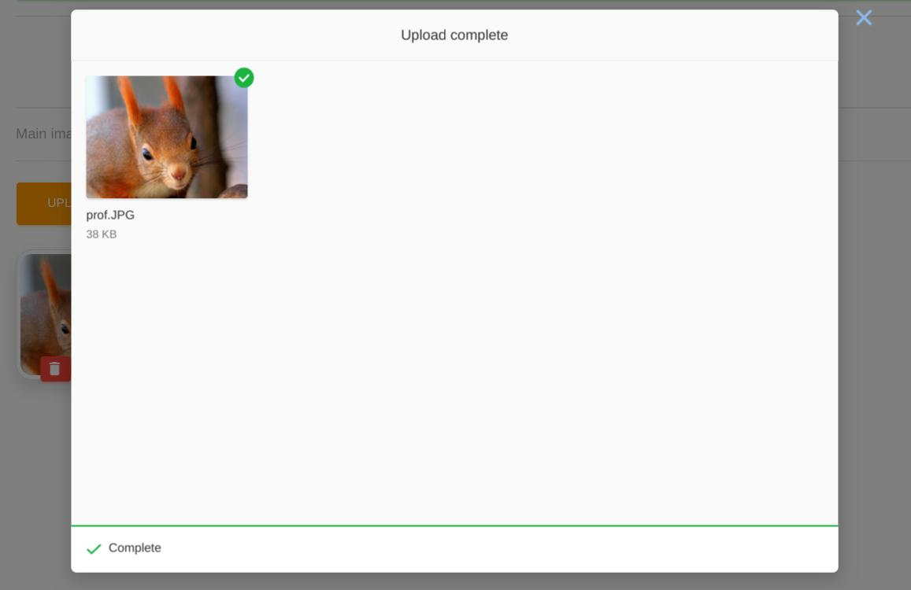

# Uppy widget


An [Uppy](https://github.com/transloadit/uppy) upload box widget.

## Sample
```php
use Sanjab\Widgets\File\UppyWidget;

$this->widgets[] = UppyWidget::image('image', 'Image')
    ->disk('local')
    ->width(640)
    ->height(480)
    ->watermark(public_path('watermark.png'));

$this->widgets[] = UppyWidget::create('videos', 'Videos')
    ->videoOnly()
    ->multiple();

$this->widgets[] = UppyWidget::create('manual', 'Manual')
    ->mimeTypes(['application/pdf']);
```

## Properties

### min
`type: number`

the minimum number of files.

### max
`type: number`

the maximum number of files.

### maxSize
`type: number`

maximum size of each file in KiloBytes.

### disk
`type: string`

default: `'public'`

Disk name to store uploaded file on that.

> Does not work if you use custom `fileStoreCallBack`

### directory
`type: string`

Directory to save files in that.

```php
->directory(now()->year.'/'.now()->month)
```

### fileRules
`type: string | array`

File validation rules.

```php
->fileRules('dimensions:min_width=100,min_height=200')
```

### width
`type: int`

resize the width for images only.

> Does not work if you use custom `fileStoreCallBack`

### height
`type: int`

resize the width for images only.

> Does not work if you use custom `fileStoreCallBack`

### watermark($watermark, string $position = 'top-left', int $x = 0, int $y = 0)

Insert watermark to images.

$watermark: Path of watermark file or instance of `Intervention\Image\Image`.

$position: the position of the watermark

$x: x distance from the edge

$y: y distance from the edge

> Does not work if you use custom `fileStoreCallBack`

### multiple
`type: boolean`

Allow to upload multiple files.
```php
$this->widgets[] = UppyWidget::image('images', 'Images')
    ->multiple()
```

> You should also add `$casts` in your model.
```php
protected $casts = [
    'images' => 'array'
];
```

### fileStoreCallBack

Callback to save uploaded files to disk.

Example: just a simple save.

```php
->fileStoreCallBack(function (\Illuminate\Http\UploadedFile $file) {
    return $file->store('public');
})
```

Example: Using [Intervention image](http://image.intervention.io).

```php
->fileStoreCallBack(function (\Illuminate\Http\UploadedFile $uploadedFile) {
    \Storage::disk('public')->put($uploadedFile->hashName(), Image::make($uploadedFile)->greyscale()->encode());
    return $uploadedFile->hashName();
});
```
